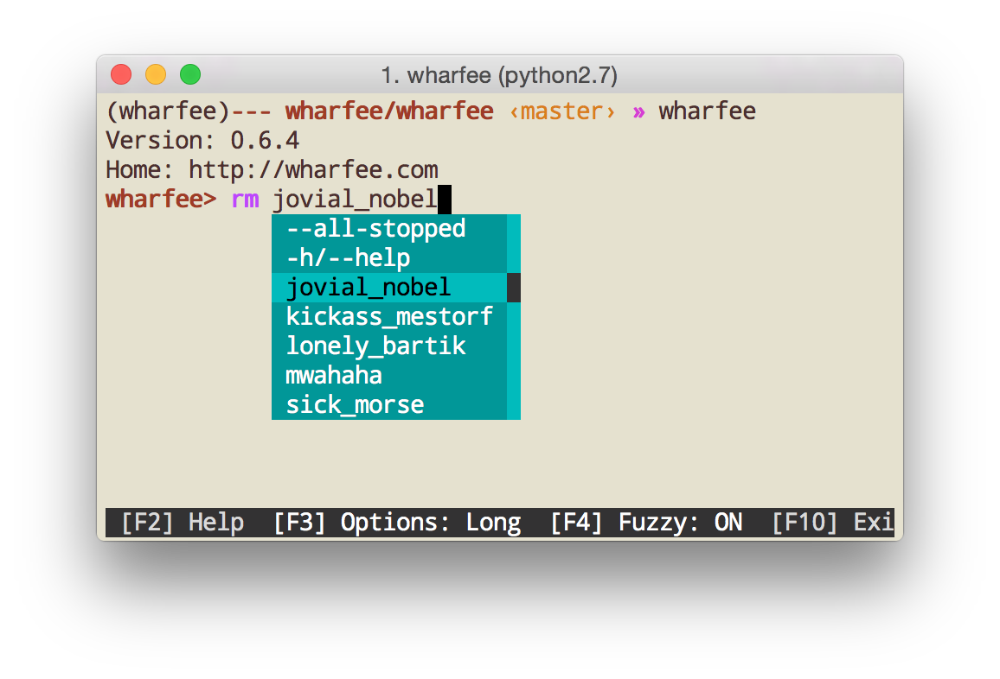
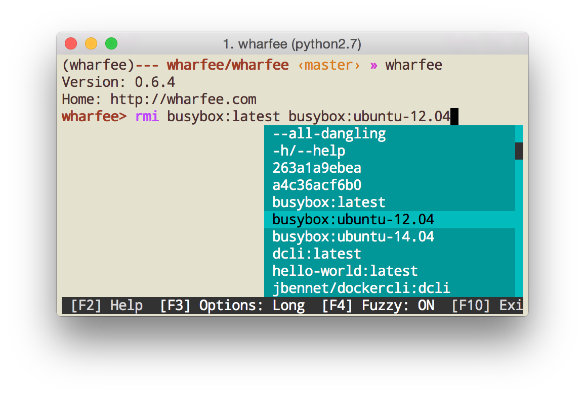

# dockercli
A CLI with autocompletion and syntax highlighting for Docker commands.

## Why?

Docker commands have tons of options. They are hard to remember.

Container names are hard to remember and type.

Same goes for image names.

There are some handy shortcuts too. What was that command ro remove all dangling images? OMG, what was it? docker rmi $(docker ps --all --quiet)? Oh, there you go:

Boom! How about removing all stopped containers?

Ah, if only everything in life was so easy.

## What are you using?

* To talk to Docker: [docker-py](https://github.com/docker/docker-py).
* To power the CLI: [Python Prompt Toolkit](http://github.com/jonathanslenders/python-prompt-toolkit).
* To format the output: [tabulate](https://pypi.python.org/pypi/tabulate).
* To print out the output: [Click](http://click.pocoo.org/3/).

## Is it perfect?

Not... yet. But I believe it can be.
