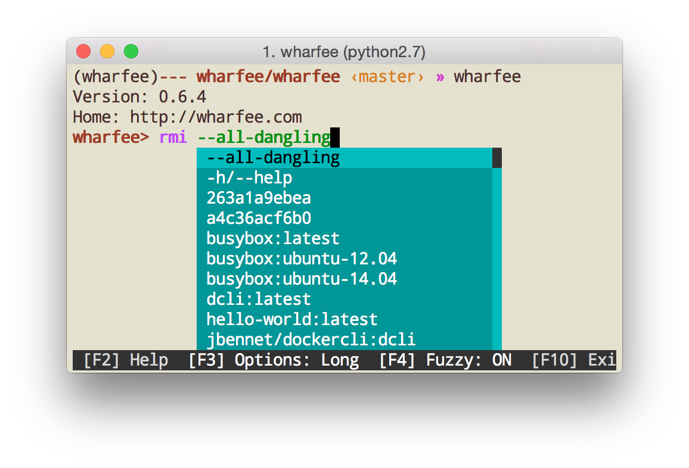

# dockercli
A CLI with autocompletion and syntax highlighting for Docker commands.

## Why?

Docker commands have tons of options. They are hard to remember.

Container names are hard to remember and type.

Same goes for image names.

There are some handy shortcuts too. What was that command ro remove all dangling images? OMG, what was it? docker rmi $(docker ps --all --quiet)? Oh, there you go:

Boom! How about removing all stopped containers?

## Installation

Dockercli is a Python package hosted on pypi and installed with:

    $ pip install dockercli

## What are you using?

* To talk to Docker: [docker-py](https://github.com/docker/docker-py).
* To power the CLI: [Python Prompt Toolkit](http://github.com/jonathanslenders/python-prompt-toolkit).
* To format the output: [tabulate](https://pypi.python.org/pypi/tabulate).
* To print out the output: [Click](http://click.pocoo.org/3/).

## Can I contribute?

Yes! Pull request or [issues](https://github.com/j-bennet/dockercli/issues) are welcome.

## How do you test it?

First, install the requirements for testing:

    $ pip install -r requirements-dev.txt

There are unit tests under *tests*. The command to run them is:

    $ py.test

Additionally, there are integration tests, that can be run with:

    $ behave

To see stdout/stderr, use the following command:

    $ behave --no-capture
